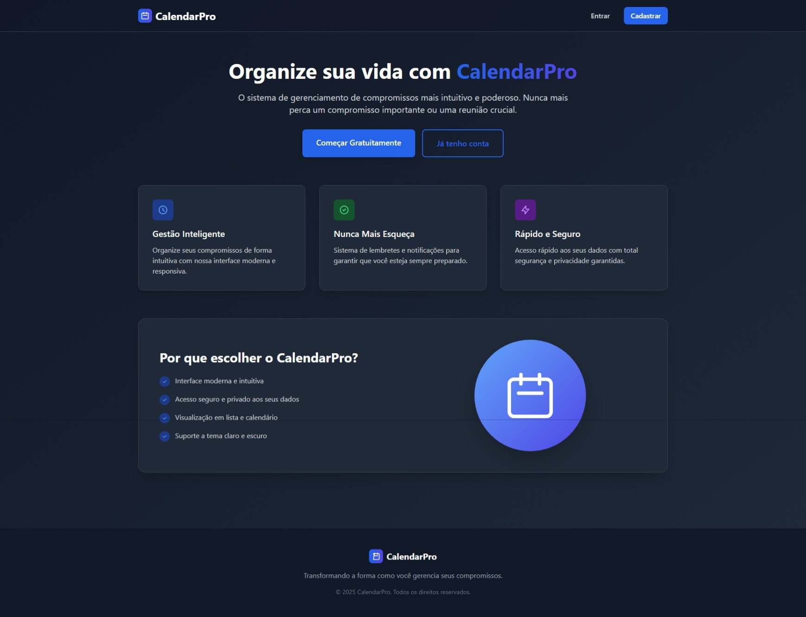

<p align="center"></p>

# 📅 Sistema de Calendário Laravel

<p align="center">


</p>

## 🎓 Projeto Acadêmico

**Instituição**: Instituto Federal de Mato Grosso do Sul - Campus Bonito (IFMSCB)  
**Curso**: Análise e Desenvolvimento de Sistemas  
**Período**: 6º Semestre  
**Disciplina**: Desenvolvimento em Frameworks Web
**Objetivo**: Desenvolvimento de sistema web completo utilizando framework Laravel

---

## 🚀 Sobre o Projeto

Um sistema moderno e elegante de gerenciamento de compromissos desenvolvido com Laravel como atividade prática do curso de Análise e Desenvolvimento de Sistemas. Nossa plataforma oferece uma experiência intuitiva para organizar sua agenda pessoal ou profissional com recursos avançados de administração.

### ✨ Principais Funcionalidades

- **📋 Gerenciamento de Compromissos**: Crie, edite e remova compromissos facilmente
- **🌓 Tema Escuro/Claro**: Interface adaptável com suporte completo a modo escuro
- **👥 Sistema de Usuários**: Autenticação segura com perfis personalizados
- **🔐 Painel Administrativo**: Controle total sobre usuários e sistema
- **📱 Design Responsivo**: Funciona perfeitamente em desktop e mobile
- **🛡️ Segurança Avançada**: Middleware de bloqueio e controle de acesso
- **⏰ Fuso Horário Inteligente**: Configuração automática de horários locais

## 🛠️ Tecnologias Utilizadas

- **Backend**: Laravel 12
- **Frontend**: Blade Templates + Tailwind CSS
- **Banco de Dados**: MySQL/PostgreSQL
- **Autenticação**: Laravel Breeze
- **Build Tools**: Vite
- **Gerenciamento de Dependências**: Composer + PNPM

## 📚 Conceitos Acadêmicos Aplicados

### Engenharia de Software
- **MVC (Model-View-Controller)**: Arquitetura bem definida
- **Design Patterns**: Repository, Factory, Observer
- **SOLID Principles**: Código limpo e manutenível
- **PSR Standards**: Seguindo padrões PHP

### Banco de Dados
- **Modelagem Relacional**: Estrutura normalizada
- **Migrations**: Versionamento do schema
- **Eloquent ORM**: Mapeamento objeto-relacional
- **Seeders**: População de dados de teste

### Segurança
- **Autenticação**: Sistema robusto de login
- **Autorização**: Controle de acesso por roles
- **Middleware**: Filtros de segurança
- **CSRF Protection**: Proteção contra ataques

### Interface e UX
- **Responsive Design**: Adaptação a diferentes telas
- **Acessibilidade**: Seguindo padrões WCAG
- **Dark/Light Theme**: Experiência personalizada
- **Component-Based**: Reutilização de código

## 📦 Instalação

### Pré-requisitos

- PHP 8.2 ou superior
- Composer
- Node.js e PNPM
- MySQL ou PostgreSQL

### Passos para Instalação

1. **Clone o repositório**
```bash
git clone <url-do-repositorio>
cd calendar-laravel
```

2. **Instale as dependências PHP**
```bash
composer install
```

3. **Instale as dependências Node.js**
```bash
pnpm install
```

4. **Configure o ambiente**
```bash
cp .env.example .env
php artisan key:generate
```

5. **Configure o banco de dados**
   - Edite o arquivo `.env` com suas credenciais de banco
   - Execute as migrações:
```bash
php artisan migrate --seed
```

6. **Compile os assets**
```bash
pnpm run build
```

7. **Inicie o servidor**
```bash
php artisan serve
```

## 🎯 Como Usar

### Para Usuários

1. **Registro/Login**: Acesse a página inicial e crie sua conta
2. **Dashboard**: Visualize seus compromissos e estatísticas
3. **Criar Compromisso**: Use o botão "Novo Compromisso" para adicionar eventos
4. **Gerenciar**: Edite ou remova compromissos existentes
5. **Perfil**: Atualize suas informações pessoais

### Para Administradores

1. **Painel Admin**: Acesse funcionalidades administrativas
2. **Gerenciar Usuários**: Visualize, edite ou bloqueie usuários
3. **Relatórios**: Acompanhe estatísticas do sistema

## ⚙️ Configurações

### Fuso Horário

Para configurar o fuso horário correto, adicione no arquivo `.env`:
```env
APP_TIMEZONE=America/Sao_Paulo
```

### Tema Escuro

O sistema detecta automaticamente a preferência do usuário e oferece alternância manual entre temas.

## 🔧 Desenvolvimento

### Executar em modo de desenvolvimento
```bash
# Terminal 1 - Servidor Laravel
php artisan serve

# Terminal 2 - Build assets em tempo real
pnpm run dev
```

### Estrutura do Projeto

```
app/
├── Http/Controllers/     # Controladores
├── Models/              # Modelos Eloquent
├── Middleware/          # Middlewares customizados
resources/
├── views/               # Templates Blade
├── css/                 # Estilos CSS
├── js/                  # JavaScript
database/
├── migrations/          # Migrações do banco
├── seeders/            # Seeders para dados iniciais
```

## 📋 Funcionalidades Implementadas

- [x] Sistema de autenticação completo
- [x] CRUD de compromissos
- [x] Painel administrativo
- [x] Tema escuro/claro
- [x] Design responsivo
- [x] Middleware de segurança
- [x] Controle de usuários bloqueados
- [x] Configuração de fuso horário
- [x] Seeders para dados de teste
- [x] Validação de formulários

## 🎯 Objetivos de Aprendizagem Alcançados

- ✅ **Framework Laravel**: Domínio das principais funcionalidades
- ✅ **Arquitetura MVC**: Separação clara de responsabilidades
- ✅ **Banco de Dados**: Modelagem e relacionamentos
- ✅ **Autenticação**: Implementação segura de login/registro
- ✅ **Frontend**: Interface moderna e responsiva
- ✅ **Versionamento**: Uso do Git para controle de versão
- ✅ **Deploy**: Preparação para ambiente de produção

## 👨‍🎓 Autor

**Nome**: Osiris Vinicius Mendes de Souza 
**Email**: osiris.souza@estudante.ifms.edu.br  
**GitHub**: viniszofx 

## 📄 Licença

Este projeto está sob a licença MIT. Veja o arquivo [LICENSE](LICENSE) para mais detalhes.

## 📞 Suporte Acadêmico

Para dúvidas sobre o projeto:
- 📧 Email institucional: [osiris.souza@estudante.ifms.edu.br]
- 💬 Issues: Use a aba Issues do GitHub

---

<p align="center">
<strong>Instituto Federal de Mato Grosso do Sul - Campus Corumbá</strong><br>
Análise e Desenvolvimento de Sistemas - 6º Período<br>
Desenvolvido com ❤️ usando Laravel
</p>
